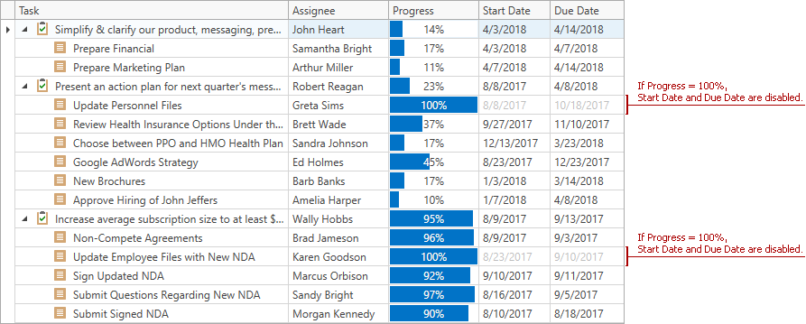
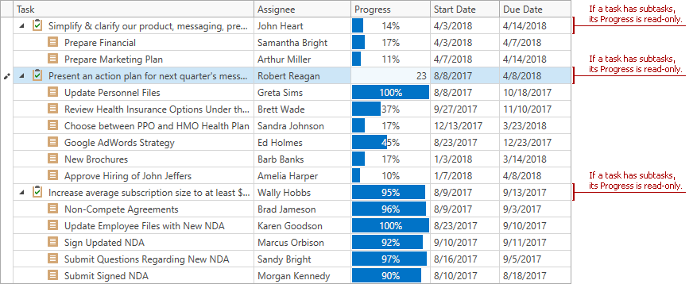

<!-- default badges list -->

<!-- default badges end -->
# Read-Only and Enabled State Binding

The example uses [BaseColumn.IsEnabledBinding](https://docs.devexpress.com/WPF/DevExpress.Xpf.Grid.BaseColumn.IsEnabledBinding) property to disable the **StartDate** and **Due Date** cells if the **Progress** value equals **100%**:

... and the [BaseColumn.IsReadOnlyBinding](https://docs.devexpress.com/WPF/DevExpress.Xpf.Grid.BaseColumn.IsReadOnlyBinding) property to make the **Progress** cells read-only if a task has subtasks:

---

## TIP
In versions prior to **v20.2**, please use solutions from this example: [How to disable rows in GridControl based on their values](https://github.com/DevExpress-Examples/how-to-disable-rows-in-gridcontrol-based-on-their-values-e3594).
